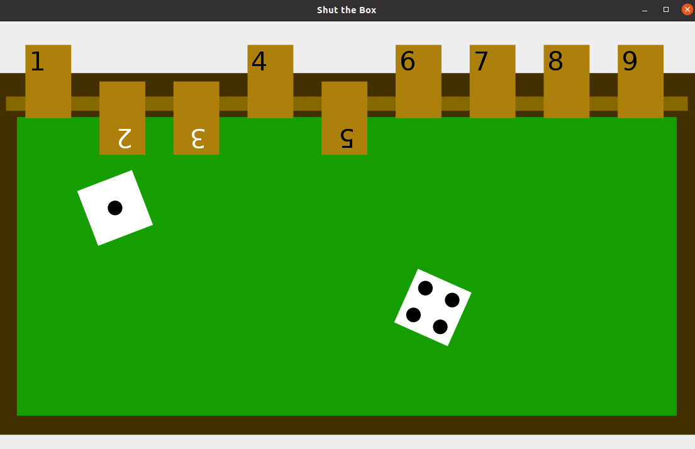

# Shut-the-Box

This is a small [Shut the Box](https://de.wikipedia.org/wiki/Shut_the_Box) "simulation" written in java. 

Included functions: 
- Gui
- logger 
- simple statigies 

it is easy to add new functions and solving methods with the help of (Passive)GameStrategy.